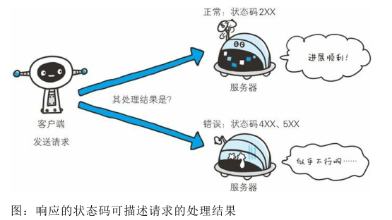
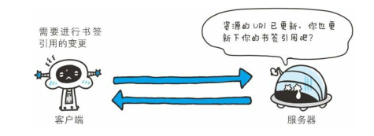
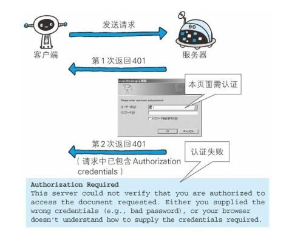
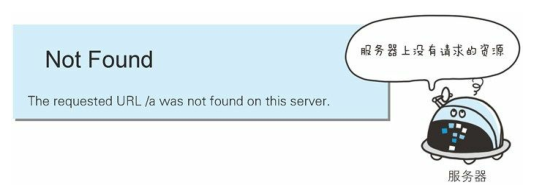
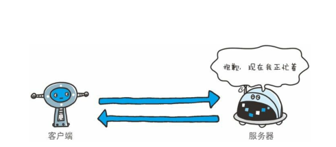

# 返回结果的HTTP状态码

+ 状态码告知从服务器端返回的请求结果
+ 2xx 成功
+ 3xx 重定向
+ 4xx 客户端错误
+ 5xx 服务端错误

### :boat:状态码告知从服务器端返回的请求结果

- 状态码的职责是当客户端向服务器端发送请求时，描述返回的请求结果。借助状态码，用户可以知道服务器端是正常处理了请求，还是出现了错误。

+ 状态码如 200 OK，以 3 位数字和原因短语组成。
+ 数字中的第一位指定了响应类别，后两位无分类。响应类别有以下 5种。

##### 表1.状态码的类别

|      | 类别    |原因短语            |
| :--------- | :--------- | :--------- |
| 1xx | Informational(信息性状态码) |接收的请求正在处理|
| 2xx | Success(成功状态码) |请求正常处理完毕|
| 3xx | Redirection(重定向状态码) |需要进行附加操作以完成请求|
| 4xx | Client Error(客户端错误状态码) |服务器无法处理请求|
| 5xx | Server Error(服务器错误状态码) |服务器处理请求错误|

接下来介绍具有代表性的14个状态码。

### :rocket:2xx 成功

2XX 的响应结果表明请求被正常处理了。

+ 200 OK

  

表示从客户端发来的请求在服务器端被<b>正常处理</b>了。
在响应报文内，随状态码一起返回的信息会因方法的不同而发生改变。比如，使用 GET 方法时，对应请求资源的实体会作为响应返回；而使用 HEAD 方法时，对应请求资源的实体首部不随报文主体作为响应返回（即在响应中只返回首部，不会返回实体的主体部分）。

+ 204 No Content

  

该状态码代表服务器接收的<b>请求已成功处理，但在返回的响应报文中不含实体的主体部分</b>。另外，也不允许返回任何实体的主体。比如，当从浏览器发出请求处理后，返回 204 响应，那么浏览器显示的页面不发生更新。
一般在只需要从客户端往服务器发送信息，而对客户端不需要发送新信息内容的情况下使用。

+ 206 Partial Content

  

该状态码表示<b>客户端进行了范围请求，而服务器成功执行了这部分的GET 请求</b>。响应报文中包含由 Content-Range 指定范围的实体内容。

### :car:3xx 重定向

3XX 响应结果表明浏览器需要执行某些特殊的处理以正确处理请求。

+ 301 Moved Permanently

  

<b>永久性重定向</b>。该状态码表示请求的资源已被分配了新的 URI，以后应使用资源现在所指的 URI。也就是说，如果已经把资源对应的 URI保存为书签了，这时应该按 Location 首部字段提示的 URI 重新保存。

像下方给出的请求 URI，当指定资源路径的最后忘记添加斜杠“/”，就会产生 301 状态码。

~~~
http://example.com/sample
~~~

+ 302 Found

  

<b>临时性重定向</b>。该状态码表示请求的资源已被分配了新的 URI，希望用户（本次）能使用新的 URI 访问。

和 301 Moved Permanently 状态码相似，但 302 状态码代表的资源不是被永久移动，只是临时性质的。换句话说，已移动的资源对应的URI 将来还有可能发生改变。比如，用户把 URI 保存成书签，但不会像 301 状态码出现时那样去更新书签，而是仍旧保留返回 302 状态码的页面对应的 URI。

+ 303 See Other

  

<i>该状态码表示由于请求对应的资源存在着另一个 URI，应使用 <b>GET方法</b>定向获取请求的资源。</i>

303 状态码和 302 Found 状态码有着相同的功能，但 303 状态码明确表示客户端应当采用 GET 方法获取资源，这点与 302 状态码有区别。

比如，当使用 POST 方法访问 CGI 程序，其执行后的处理结果是希望客户端能以 GET 方法重定向到另一个 URI 上去时，返回 303 状态码。虽然 302 Found 状态码也可以实现相同的功能，但这里使用 303状态码是最理想的。

+ 304 Not Modified

  

该状态码表示客户端发送附带条件的请求时，服务器端允许请求访问资源，但因发生请求未满足条件的情况后，直接返回304 Not Modified（服务器端资源未改变，可直接使用客户端未过期的缓存）。

<i>304状态码返回时，不包含任何响应的主体部分。304 虽然被划分在 3XX 类别中，但是和重定向没有关系。</i>

+ 307 Temporary Redirect

<b>临时重定向。</b>该状态码与 302 Found 有着相同的含义。尽管 302 标准禁止 POST 变换成 GET，但实际使用时大家并不遵守。
307 会遵照浏览器标准，不会从 POST 变成 GET。但是，对于处理响应时的行为，每种浏览器有可能出现不同的情况。

### :airplane:4xx 客户端错误

4XX 的响应结果表明客户端是发生错误的原因所在。

+ 400 Bad Request

  

该状态码表示<b>请求报文中存在语法错误</b>。当错误发生时，需修改请求的内容后再次发送请求。另外，浏览器会像 200 OK 一样对待该状态码。

+ 401 Unauthorized

  

该状态码表示<b>发送的请求需要有通过 HTTP 认证（BASIC 认证、DIGEST 认证）的认证信息</b>。另外若之前已进行过 1 次请求，则表示用 户认证失败。
返回含有 401 的响应必须包含一个适用于被请求资源的 WWW-Authenticate 首部用以质询（challenge）用户信息。当浏览器初次接收到 401 响应，会弹出认证用的对话窗口。

+ 403 Forbidden

  

该状态码表明<b>对请求资源的访问被服务器拒绝了</b>。服务器端没有必要给出拒绝的详细理由，但如果想作说明的话，可以在实体的主体部分对原因进行描述，这样就能让用户看到了。
未获得文件系统的访问授权，访问权限出现某些问题（从未授权的发送源 IP 地址试图访问）等列举的情况都可能是发生 403 的原因。

+ 404 Not Found

  

该状态码表明<b>服务器上无法找到请求的资源</b>。除此之外，也可以在服务器端拒绝请求且不想说明理由时使用。

### :truck:5xx 服务端错误

5XX 的响应结果表明服务器本身发生错误。

+ 500 Internal Server Error

  

该状态码表明<b>服务器端在执行请求时发生了错误</b>。也有可能是 Web应用存在的 bug 或某些临时的故障。

+ 503 Service Unavailable

  

该状态码表明<b>服务器暂时处于超负载或正在进行停机维护，现在无法处理请求</b>。如果事先得知解除以上状况需要的时间，最好写入RetryAfter 首部字段再返回给客户端。

